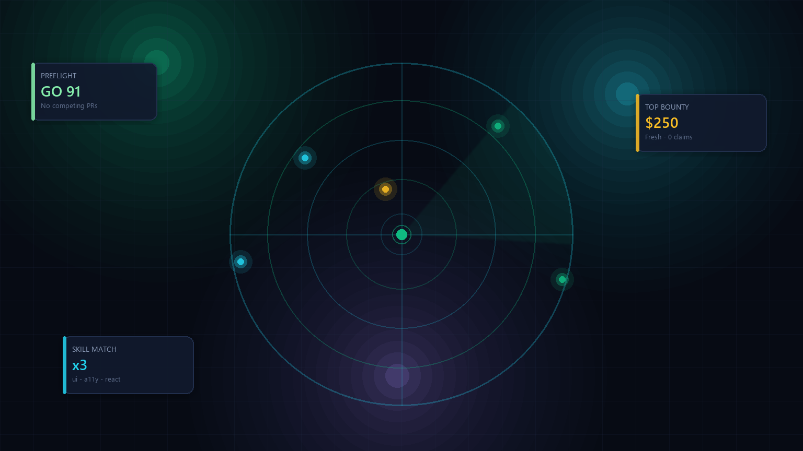

# Bounty Radar Pro



[](https://github.com/mohsen-niksirat/BountyRadar/actions/workflows/ci.yml)
[](https://github.com/mohsen-niksirat/BountyRadar/tree/main/docs)

**English** · [فارسی](./README.fa.md) · [Live site](https://mohsen-niksirat.github.io/BountyRadar/)

Local Windows app that finds **paid freelance & open-source bounties** for **any** freelancer type — frontend, backend, mobile, data/ML, DevOps, security, docs/writing, design, full-stack.

**Live site (static preview):** after enabling Pages → `https://mohsen-niksirat.github.io/BountyRadar/`

## Features

- **10 freelancer profiles** with skill-match scoring
- **Preflight quality** — competing PRs, external-merge history → **GO / CAUTION / STOP**
- **Watch mode** — re-scan every N minutes + Windows toast (first run is a silent baseline)
- **Modern web UI** — multi-filters, sort, pagination, card/table views, sparklines
- **True i18n** — English / فارسی with RTL (header language switcher)
- **No paid APIs** — Python 3 stdlib only

## Run

**Double-click `Bounty Radar.bat`** → opens `http://127.0.0.1:8765/`

```bash
git clone https://github.com/mohsen-niksirat/BountyRadar.git
cd BountyRadar
python bounty_radar.py                 # web UI (default)
python bounty_radar.py --tk            # classic Tkinter
python bounty_radar.py --scan --profile frontend
python bounty_radar.py --watch 15
python bounty_radar.py --notify-test
python test_bounty_radar.py            # offline tests
```

### Build a standalone `.exe` (no Python on target PC)

```bat
pip install -r requirements-build.txt
build.bat
:: or: python build_exe.py
:: single file: python build_exe.py --onefile
```

Output: `dist\BountyRadar\BountyRadar.exe` (plus a `Bounty Radar.bat` launcher).  
Copy the folder anywhere; `settings.json`, `claims.json`, `seen.json` are created next to the exe.

## Claim workflow

Turn a scan into work:

1. On a card, press **★ Claim** (or Shortlist)
2. Set status: **Shortlist → Working → Submitted → Won / Abandoned**
3. Tick the **preflight checklist** (open issue, competing PRs, merges external PRs, build locally, payout, time budget)
4. Add notes (deadline, branch, maintainer reply)

Filter **★ My claims** to see only your pipeline. Data lives in `claims.json`.

## Language

Use **EN | فا** in the top-right of the web UI. Choice is saved in `settings.json` and `localStorage`. Persian UI is RTL.

## Profiles

| Profile | Best for |
|---------|----------|
| Any | Widest net |
| Frontend | React, Vue, CSS, a11y, design systems |
| Backend | APIs, databases, Python/Go/Rust/Java |
| Mobile | iOS, Android, Flutter, React Native |
| Data / ML | ETL, models, analytics |
| DevOps | CI/CD, Docker, K8s, cloud |
| Security | AppSec, audits, hardening |
| Docs / Writing | Docs, tutorials, translation, i18n |
| Design | UI/UX, icons, branding, Figma |
| Full-stack | End-to-end web apps |

## Scoring

```
score = amount ÷ (1 + claims)
        × freshness     (≤7d: 1.6 · ≤30d: 1.25 · ≥120d: 0.45)
        × repo quality  (★≥1000: 1.15 · active: 1.1 · archived: 0.2)
        × skill match   (profile keywords, up to 1.45)
        × preflight     (GO 1.2 · CAUTION 0.7 · STOP 0.25)
        × penalties     (>60 comments: 0.6 · no stars: 0.7)
```

## Data sources

| Source | Gives you |
|--------|-----------|
| Algora org pages | Real $ + claim counts |
| GitHub Search | Labels, `/bounty $`, Opire bot comments |
| GitHub REST | Stars / activity for top candidates |

Add a **GitHub token** (no scopes) in Settings for higher rate limits.

## Watch mode

1. Turn **Watch** on  
2. First scan = silent baseline  
3. Every N minutes: new items highlighted + one toast  
4. `seen.json` remembers across restarts  

## Keyboard (web UI)

| Key | Action |
|-----|--------|
| `S` | Scan |
| `W` | Watch |
| `/` | Search |
| `D` | Density |
| `←` `→` | Page |
| `E` | Export CSV |
| `Esc` | Close |

## GitHub Pages

`docs/` is a static landing + demo (sample data only).

1. Settings → Pages → Source: **GitHub Actions**  
2. Site: `https://mohsen-niksirat.github.io/BountyRadar/`

## Files

```
bounty_radar.py       # engine + CLI + web server
ui/index.html         # web UI
ui/i18n.js            # EN / FA strings
docs/index.html       # GitHub Pages site
Bounty Radar.bat      # Windows launcher
test_bounty_radar.py  # offline tests
ROADMAP.md
```

## Honest limits

- Opire amounts often live only on Opire  
- Claim counts are reliable mainly for Algora  
- Many GitHub “bounty” labels are spam — keep the fake filter on  
- Run daily; watch mode is the high-value path  

## License

MIT — see [LICENSE](./LICENSE).
